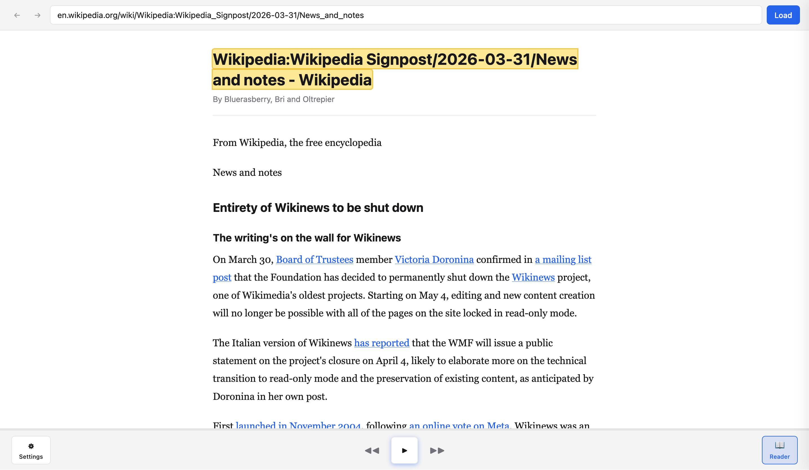

# Web Reader

Read any web page out loud. OpenAI and elevenlab are provided right now, bring your own key.




## Configuration

Open the Settings panel (gear icon) to configure:

| Setting | Description |
|---------|-------------|
| **TTS Provider** | OpenAI or ElevenLabs |
| **Model / Voice** | Provider-specific model and voice selection |
| **API Keys** | Your OpenAI or ElevenLabs API key (stored locally) |
| **CORS Proxy** | URL prefix for proxying requests, we're using iframe so cors proxy bypass is needed. By default is using mine |


## Getting Started

```bash
# Install dependencies
npm install

# Start dev server
npm run dev

# Run tests
npm test

# Build for production
npm run build
```

## License

MIT
