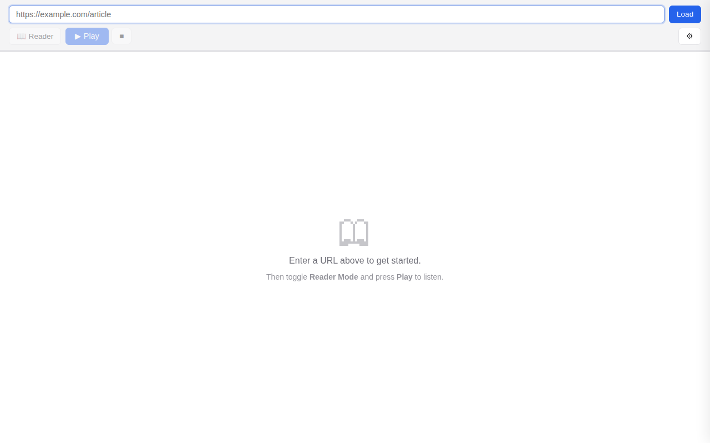

# Web Reader

A client-side web application for fetching, reading, and listening to web articles using text-to-speech. Built with vanilla JavaScript and Vite.



## Features

- **URL Loading** — Fetch any web page via a configurable CORS proxy
- **Reader Mode** — Extract clean article content using Mozilla Readability (same engine as Firefox Reader View)
- **Text-to-Speech** — Listen to articles with OpenAI TTS or ElevenLabs
- **Playback Controls** — Play, pause, resume, stop with progress tracking and sentence highlighting
- **Settings** — Configure TTS provider, model, voice, and API keys
- **Privacy-first** — Everything runs in-browser; API keys stored in localStorage only
- **Dark Mode** — Automatic theme switching via `prefers-color-scheme`

## Getting Started

```bash
# Install dependencies
npm install

# Start dev server
npm run dev

# Run tests
npm test

# Build for production
npm run build
```

## Configuration

Open the Settings panel (gear icon) to configure:

| Setting | Description |
|---------|-------------|
| **TTS Provider** | OpenAI or ElevenLabs |
| **Model / Voice** | Provider-specific model and voice selection |
| **API Keys** | Your OpenAI or ElevenLabs API key (stored locally) |
| **CORS Proxy** | URL prefix for proxying requests (defaults to `corsproxy.io`) |

## Deployment

The project includes a GitHub Actions workflow for deploying to **Cloudflare Pages** on every push to `main`.

### Setup

1. Create a Cloudflare Pages project named `web-reader`
2. Add these repository secrets in GitHub:
   - `CLOUDFLARE_API_TOKEN` — API token with Pages permissions
   - `CLOUDFLARE_ACCOUNT_ID` — Your Cloudflare account ID

### CI/CD

| Workflow | Trigger | Description |
|----------|---------|-------------|
| **CI** | Push / PR to `main` | Runs tests and builds |
| **Deploy** | Push to `main` | Tests, builds, and deploys to Cloudflare Pages |

## Project Structure

```
├── index.html          # Entry point
├── style.css           # Styles (light + dark themes)
├── vite.config.js      # Vite config with dev CORS proxy
├── src/
│   ├── main.js         # App orchestration and UI
│   ├── loader.js       # Page fetching and URL rewriting
│   ├── reader.js       # Article extraction (Readability)
│   ├── settings.js     # localStorage settings manager
│   └── tts.js          # Text chunking, audio fetching, playback queue
├── tests/              # Vitest unit tests
└── .github/workflows/  # CI and deployment workflows
```

## License

MIT
